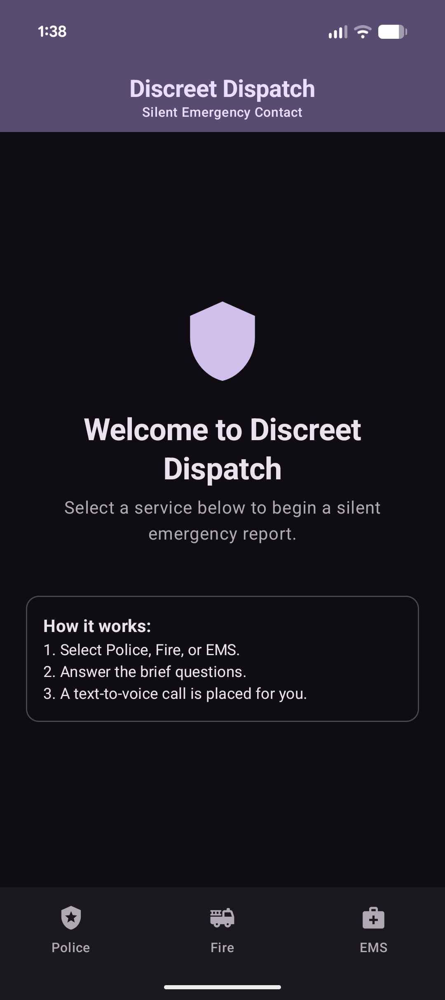
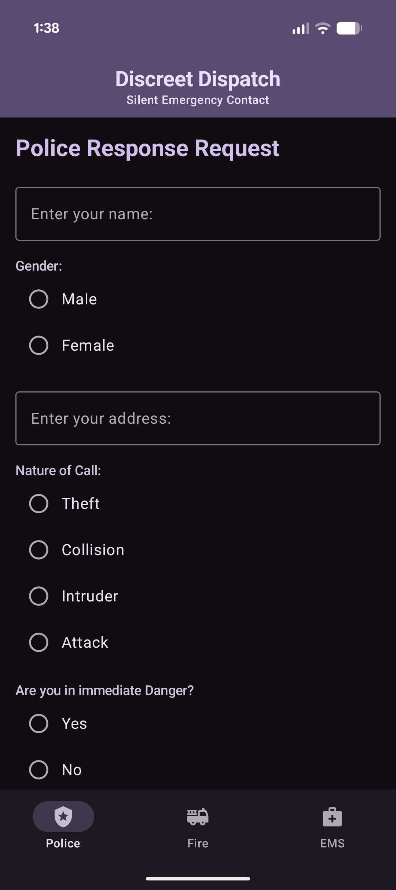
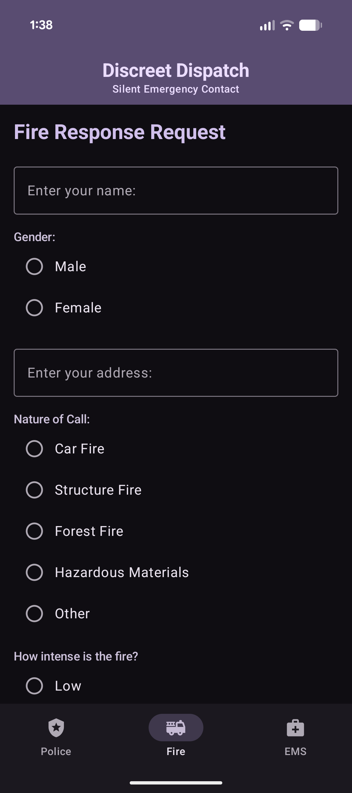
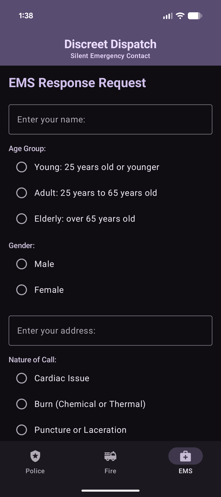
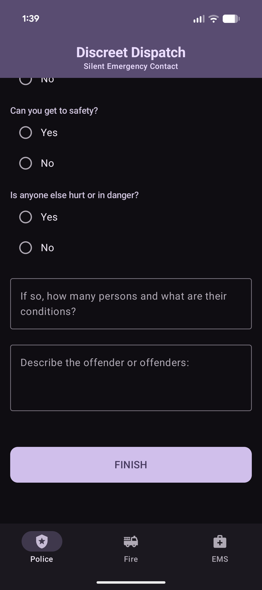
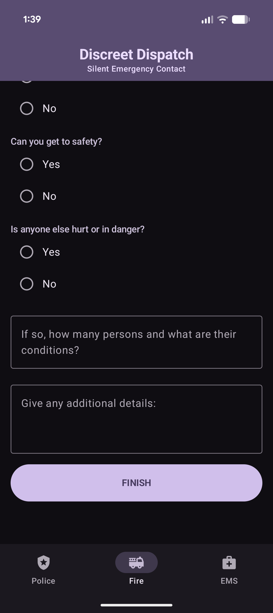
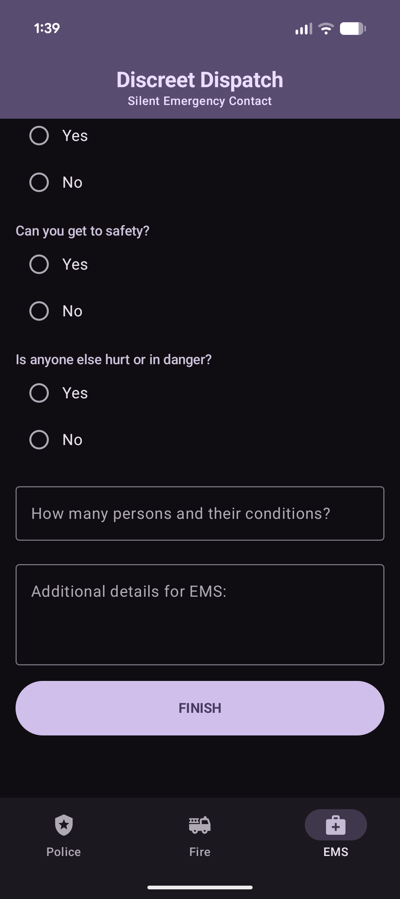
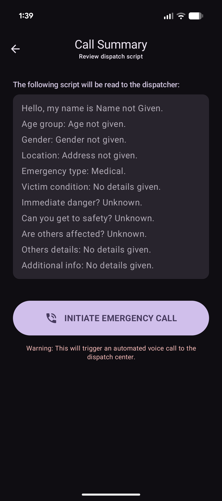
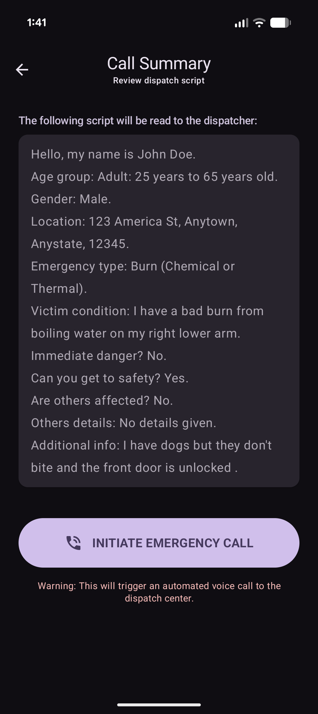
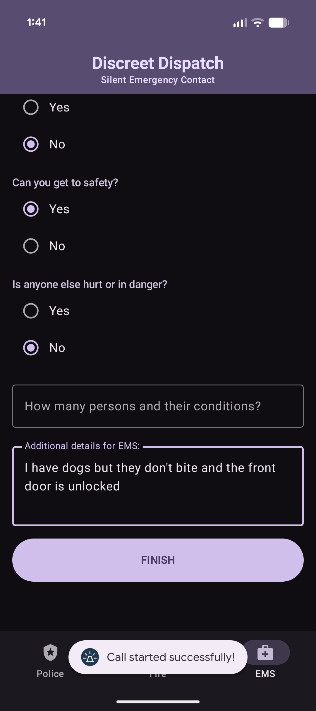

[Back to Portfolio](./)

Discreet Dispatch
===============

-   **Class: Senior Project CSCI 499** 
-   **Grade: To Be Determined** 
-   **Language(s): Kotlin & Javascript** 
-   **Source Code Repository:** [CSU-Senior-Project]((https://github.com/AndrewBurbage/CSU-Senior-Project/tree/master))  
    (Please [email me](mailto:APBurbage@student.csuniv.edu?subject=GitHub%20Access) to request access.)

## Project description

The project is to create an application that would allow users to answer a series of questions similar to those given by a dispatcher that would then be turned into a text to speech recording to be played over a phone call from the user to local emergency services. This allows for an effective and discrete silent 911 call. When the user opens the app and begins to fill out the prompts given, the responses will be stored and used to form a script that will be turned into an audio recording using text to speech. From there a call will be placed to the local dispatch where the script will be played allowing actual dispatchers to collect the needed information to deploy first responders effectively. This allows the user to be discreet or to make an audible call they are incapable of while also allowing dispatchers to get most of the needed information in one concise interaction.
## How to compile and run the program

How to run the project.

To run the program simply download the files from the repository and open them with Android Studio, then use either a emulator or actual phone to run the app. To use an actual phone turn on developer settings on the phone and allow wireless debugging, then go to add devices in Android Studio and select "Pair Devices Using Wi-Fi" and follow the instructions given. Once the emulator is configured or the device paired simply run the program using the run option on the top bar.

## UI Design

On the opening page the user will be welcomed by the title of the application in the top banner (Fig. 1). As they look down they will see a welcome message followed by a prompt to “Select a service below to begin a silent emergency report.” Following that is a “How it works” section that explains in three steps the selection, survey, and call flow. Below this at the bottom of the screen are the three choices of emergency responder to choose from based on their emergency. The type of responder was selected to keep the flow simple and quick allowing the user to quickly assess if they need Police, Fire, or EMS. Taping on any of the three options opens up the page and the bar stays persistent in case they made the wrong selection.

Having selected an emergency type/responder the user is given a series of questions similar to those asked by a dispatcher in real life (Fig. 2-4). The set of questions consist of Identifiers both of the victim, perpetrator(if a crime), the situation, safety of the situation/individuals, and finally a section for additional information the user may feel is pertinent. All of these questions are customized to the type of emergency responder/type selected. The questions utilize a series of text fields and radio buttons allowing for either an answer to be filled out or selected based on the type of question. The Textfields have a greyed out prompt that migrates to the top of the text field when filled out and the radio buttons fill in the selection made as solid circles vs the given empty circles. All fields also contain default answers in case they are not or cannot be answered.

After Filling out all of the questions the user will see a large “FINISH” button at the bottom of the page (Fig. 5-7). Upon clicking on this button they will be brought to a review page(Fig. 8 & 9). Here, their script that has been formed from the questions they previously answered will be displayed. This allows the user to quickly review their answer before confirming they want to place the call with that script. If there are errors they can simply press back and they will be able to edit their responses or even pick a different emergency responder/type. Once satisfied with their response they will click a button below the script that says “INITIATE EMEREGENCY CALL” followed by a warning in red that states tapping the button “will trigger an automated voice call to the dispatch center.” Having clicked the button the user will receive a toast at the bottom of the screen that states: “Call started successfully!” after being taken back to the prompt page(Fig. 10). From here they can either close the app or double check their responses in case an additional call needs to be placed due to new information or more accurate information.

  
Fig 1. The launch screen

  
Fig 2. Police page top.

  
Fig 3. Fire page top.

  
Fig 4. EMS page top.

  
Fig 5. Police Finish.

  
Fig 6. Fire finish.

  
Fig 7. EMS finish.

  
Fig 8. Empty script for review.

  
Fig 9. Filled out script for review.

  
Fig 10. Completion toast after succesful call.

## 3. Additional Considerations

Ensure that you have a proper connection to the internet and change the phone number (Located in CallPage.kt) the call is directed to so that you can test the call side as well.

[Back to Portfolio](./)
