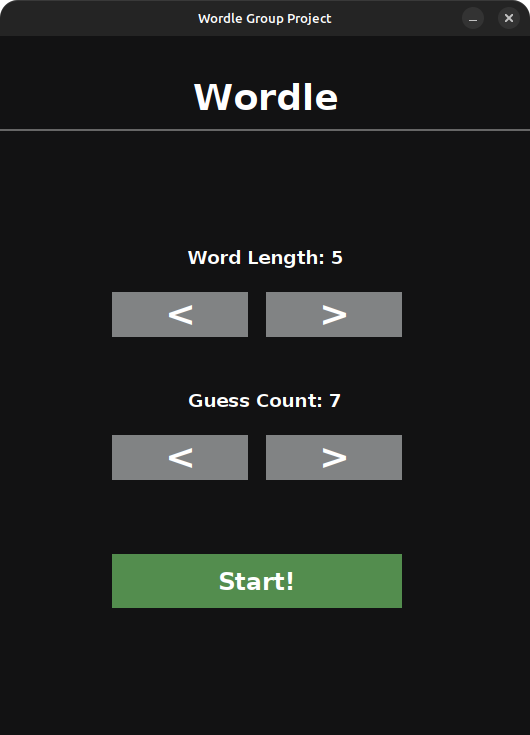
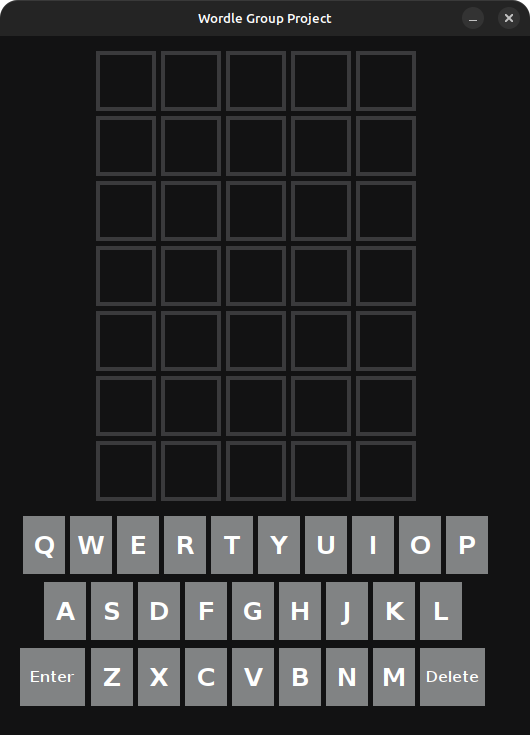
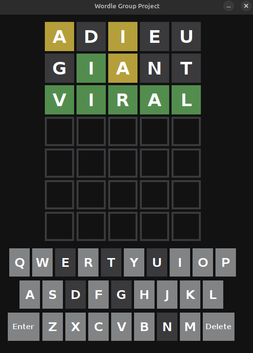
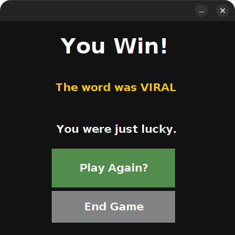

[Back to Portfolio](./)

Wordle Emulator
===============

-   **Class: CSCI 325 Object Oriented Programming** 
-   **Grade: A** 
-   **Language: Java** 
-   **Source Code Repository:** [Wordle Emulator](https://github.com/koimcf2005/WordleGroupProject)  
    (Please [email me](apburbage@csustudent.net?subject=GitHub%20Access) to request access.)

## Project description

The project consists of a game made to look and act like Wordle from the New York Times, it uses Java Swing for the user interface. The ability to change word size, guess count, and taunting replies upon sucess or failure to guess were additional features that were added.

## How to compile and run the program

How to compile and run the project.

---

### 1. Verify Requirements

-- Install NetBeans 20+ (or any version supporting JDK 21).  
-- Install JDK 21 and set it as a recognized Java Platform in NetBeans.  

The project requires Java 21 because the properties file includes:  
`javac.source=21` and `javac.target=21`.

---

### 2. Import the Project into NetBeans

1. Start NetBeans.  
2. Go to **File → Open Project**.  
3. Select the **WordleGroupProject** directory (the one containing nbproject/).  
4. NetBeans will detect it as an **Ant Java Project**.  
5. Click **Open Project**.

---

### 3. Set the Java Platform

Right-click the project → **Properties** → **Libraries**.
Choose **JDK 21** as the active platform.  

---

### 4. Build and Run the Project

#### Build  
Right-click the project → **Build**  

#### Run  
Right-click the project → **Run**.

---

### 7. Clean the Project

Right-click → **Clean**  

---

### 8. Running the JAR Manually

After building, you can run the program from a terminal using the following command:

`java -jar dist/WordleGroupProject.jar`

---

## UI Design

The user starts on the home screen, where they can choose the game's difficulty by selecting the word length (4 to 11 letters) and the max number of guesses (4 to 10 attempts) (see Fig 1). After confirming their choices and pressing "Start," the game board appears with a blank grid ready for input (see Fig 2). 

While playing, the user enters a guess using the on-screen or physical keyboard and submits it. Each letter tile is immediately color-coded: green for correct letter in the right position, yellow for correct letter in the wrong position, and gray for letters not in the word. This process repeats until the user correctly guesses the word or runs out of guesses (see Fig 3). 

Upon completion (win or loss), a results screen appears displaying the target word, the number of attempts used, and two buttons: "Play Again" to start a new game with the same settings, and "Quit" to return to the home screen (see Fig 4).

  
Fig 1. The home/customization screen where word size and number of guesses are selected.

  
Fig 2. The empty game board at the start of the game.

  
Fig 3. The game board during a game, displaying color-coded feedback after guesses.

  
Fig 4. The win/loss results screen with "Play Again" and "Quit" options.

## 3. Additional Considerations
This project is a Windows-only executable and will not run on macOS or Linux.

[Back to Portfolio](./)
